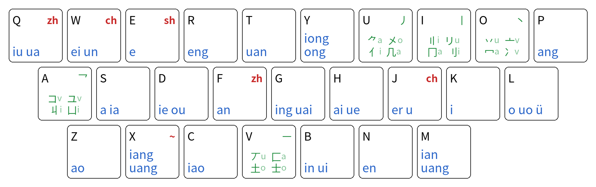

# 键道・函流 - 键道（KeyTao）双形顶功输入方案

基于[键道6](https://github.com/xkinput/KeyTao)（KeyTao）的布局与设计，抛弃了固定码表。进而采用了词库和逻辑顺序。

## 布局



### 其他布局
* 27键无飞键版本 - [键道27・流](https://github.com/xkjd27/rime_jd27_flow)
* Colemak 版本 - [键道27C・流](https://github.com/xkjd27/rime_jd27c_flow)

## 与键道6的区别

| | 键道6 | 键道・函流 |
| --- | ---|---|
| 码表词库 | ❌ 固定码表 | ✅ 笔码搭配任意音码词库 |
| 词组码长 | ❌ 最长6码，无全码 | ✅ 按词组长度配置全码，简码自动排权 |
| 码长调整 | ❌ 纯手动排码排重 | ✅ <kbd>-</kbd> <kbd>=</kbd> 键排码功能，自动避重 |
| 用户词 | ❌ 需要改文件部署 | ✅ <kbd>`</kbd> 键造词功能 |
| 次码支持 | ➖ 预设 | ➖ 默认不支持 Tab 上屏和修改 |
| 声笔笔简码 | ✅ 支持 | ❌ 不支持 |
| 单字模式 | ✅ 支持 | ❌ 不支持 |

由于 键道・函流 使用词库权重自动排码，候选顺序可能与键道6原版略有出入；
但有了自主排码功能，用户可以自己实时修改码长。

另外由于使用了大量 lua 脚本，该方案性能可能不如键道6。

## 词库

本仓库自带三套词库，使用 `keytao_table_to_flow_dict.py` 脚本生成：

| 词库 | 来源 |
| --- | --- |
| `keytao_flow.keytao`（默认） | 键道原版码表转换，适合希望平替键道6的用户 |
| `keytao_flow.ice` | 词库量大，长词组多，适合希望开箱即用的用户 |
| `keytao_flow.simp` | 网络用语与长词组较少，适合希望避免词库冗余且倾向于自主造词的用户 |


## 排码

在打字过程中，使用 <kbd>-</kbd> <kbd>=</kbd> 按键即可排码：
- <kbd>-</kbd> 缩短编码，提高权重
- <kbd>=</kbd> 加长编码，降低权重

## 造词

按 <kbd>`</kbd> 进入造词模式。在造词模式中，正常输入希望要编码的词组或句子。输入过程中不会完全上屏，输入完成后：
- 按 <kbd>-</kbd> 自动以词组全码加入词库，之后继续按 <kbd>-</kbd> <kbd>=</kbd> 调整新词的码长
- 按 <kbd>=</kbd> 删除自造词或清空输入法自带词库中的排码（非自造词只能还原默认编码权重，不可删除）

## 用户词库

在用户配置目录中，会生成 `keytao_flow.order.userdb` 用户词库，用于存储所有自造词与编辑过的排码。请注意备份保存，避免词库丢失。同步和备份时请删库覆盖，合并词库可能会导致算法异常

## 配置

可调项写在用户配置目录的 `keytao_flow.custom.yaml`，重新部署后生效：

```yaml
patch:
  # 词库：
  # keytao_flow.keytao 键道原版码表 默认
  # keytao_flow.ice 雾凇拼音
  # keytao_flow.simp 袖珍简化字
  translator/dictionary: keytao_flow.keytao

  # 调序与造词数据库：
  # leveldb 高性能 默认
  # txt 纯文本 方便手动修改
  flow_order/backend: leveldb

  # 最近造词列表上限（默认 20）
  flow_order/recent_max: 20

  # 候选提示配置
  flow_hint:
    # 笔码提示
    shape: true
    # 不可顶功提示（⛔️）
    topup: true

  # 键道・函流默认一简码就有多个候选，默认没有 Tab 次简
  # 请阅读 keytao_flow.secondary.yaml 了解这个功能在该方案下的使用方式
  flow_secondary: false
```

## 致谢与许可

* 键道原作者：吅吅大山（[键道网站](https://keytao.rea.ink/)）
* 雾凇拼音词库 [rime-ice](https://github.com/iDvel/rime-ice)

本方案开源许可为 **GPL-3.0**（见 `LICENSE`）。
